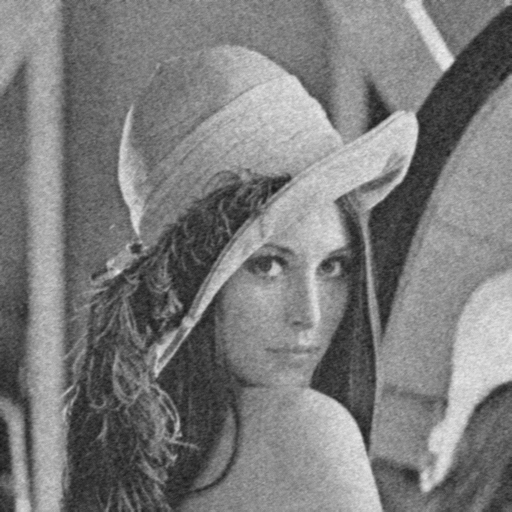

# Mean Filter

The implement of mean filter using pure C.

## Parameter of Algorithm

* **filter size=3**

## Input

**Name: lena_gray_noise.raw**  
**image size=512x512**  
  

## Result

**Name: lena_gray_noise_MFsize3.bmp**  
**image size=512x512**  

  